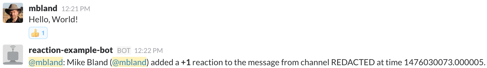

# hubot-slack-reaction-example

Source: https://github.com/mbland/hubot-slack-reaction-example

[](https://www.npmjs.com/package/hubot-slack-reaction-example)

This is a chat bot built on the [Hubot][hubot] framework that demonstrates how
to handle the `ReactionMessage` type introduced in [hubot-slack][hubot-slack]
v4.1.0.

All of the example code is in `scripts/handle-reaction.coffee`.

[hubot]: http://hubot.github.com
[hubot-slack]: https://www.npmjs.com/package/hubot-slack

## Running the bot

1. Clone this repo:
   ```sh
   $ git clone https://github.com/mbland/hubot-slack-reaction-example
   $ cd hubot-slack-reaction-example
   $ npm install
   ```

1. You must have administrator access for your Slack domain. Alternatively, you
   can [create your own personal slack domain][slack-create] for testing.

1. If you don't have an existing API token handy, [create a new test
   token][slack-test-token]. If you have to do this, open the
   `node_modules/hubot-slack/src/bot.coffee` file and find the following line
   from the `SlackBot.reaction` method:
   ```coffeescript
   return if (user == @self.id) || (user == @self.bot_id) #Ignore anything we sent
   ```
   Change the `(user == @self.id)` condition to use `!=` instead. This is
   because the test token will cause your bot to run as your user, so any
   reactions you add yourself will normally be discarded. (Of course you'd
   normally associate a [Slack bot user][slack-bot-user] with your actual app.)

1. Run the bot:
   ```sh
   $ HUBOT_SLACK_TOKEN=<your-test-token> ./bin/hubot --adapter slack
   ```
   you should see output like:
   ```
   [Wed Oct 05 2016 17:46:50 GMT-0400 (EDT)] INFO Logged in as mbland of mbland
   [Wed Oct 05 2016 17:46:50 GMT-0400 (EDT)] INFO Slack client now connected
   [Wed Oct 05 2016 17:46:50 GMT-0400 (EDT)] INFO Listening for reaction_added, reaction_removed events
   ```

1. Post a message in your Slack domain and add an emoji reaction to it.

Now you should see something like:

<figure>
<br/>
<figcaption>After the message received the <em>+1</em> emoji reaction, the
example bot posted a response to the channel reporting the details of the
event. Notice that the bot runs as the user that created the API token, which
is why we needed to edit <code>SlackBot.reaction</code> above.</figcaption>
</figure>

[slack-create]: https://slack.com/create
[slack-bot-user]: https://api.slack.com/bot-users]
[slack-test-token]: https://api.slack.com/docs/oauth-test-tokens

## Copyright

This software is made available as [Open Source software][oss] under the [ISC
License][isc]. For the text of the license, see the [LICENSE](LICENSE.md) file.

That said, this is example code. Feel free to do with it what you like even
without retaining the copyright. However, since publishing code as public domain
still seems more complicated than it needs to be, the license is there if you
need legal coverage.

[oss]: https://opensource.org/osd-annotated
[isc]: https://www.isc.org/downloads/software-support-policy/isc-license/
